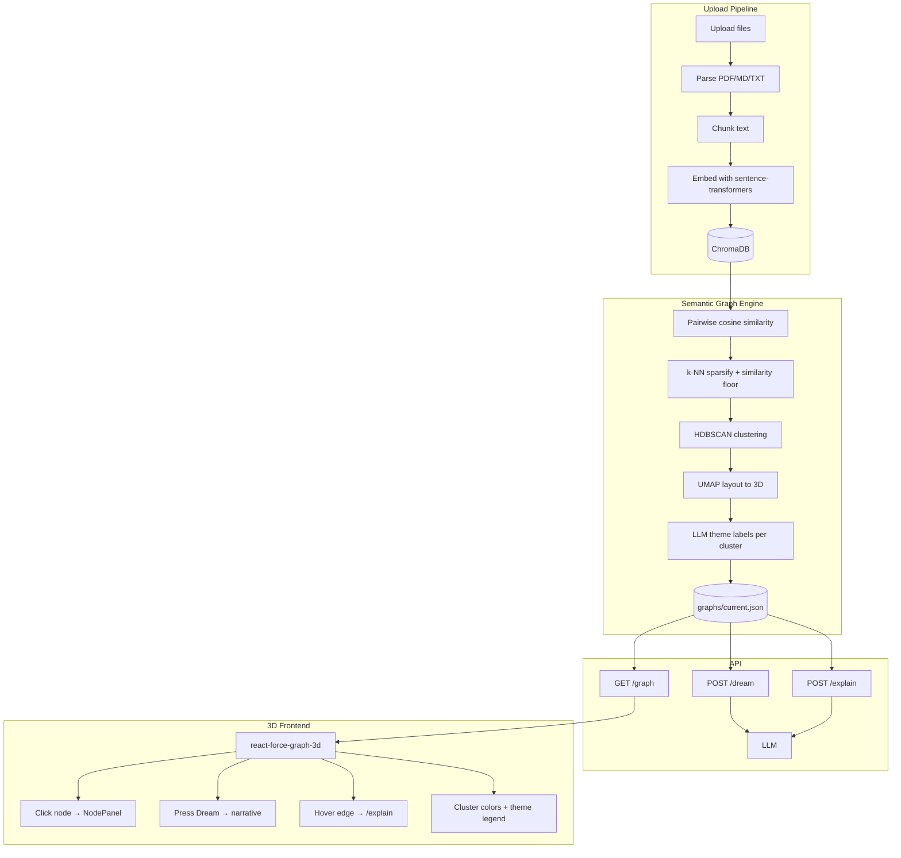
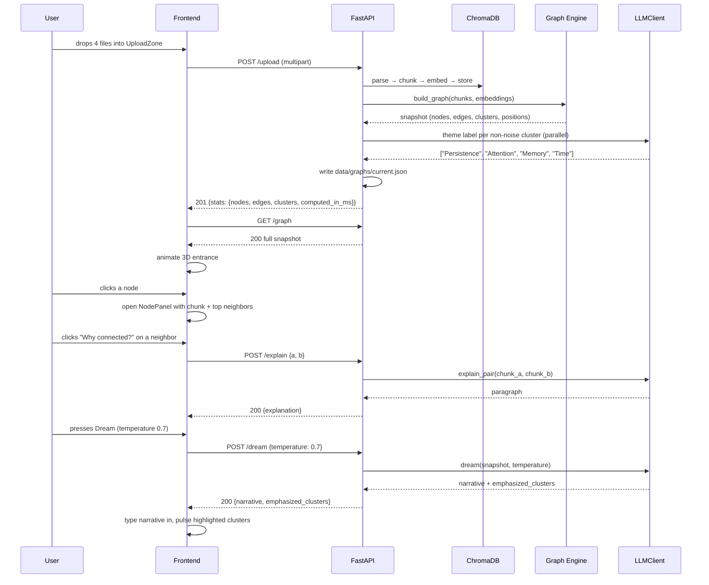

# Architecture

## High-level diagram



## Layered backend code structure

The backend is intentionally four layers, with strict direction of
dependency: `api/ → core/ → db/` and `core/` may also depend on
`llm/`. Layers below never import from layers above.

```
backend/app/
├── api/             # HTTP layer (FastAPI routers, request/response)
├── core/            # Business logic (no FastAPI, no chromadb)
├── db/              # Persistence (the ONLY place chromadb is touched)
├── llm/             # LLM client Protocol + implementations
├── schemas.py       # Pydantic models shared by api/ and core/
├── config.py        # Pydantic Settings (env-driven configuration)
└── main.py          # FastAPI app factory and wiring
```

Why these layers:

- **`api/`** is thin. It validates input with Pydantic, calls into
  `core/`, and serializes the result. Swapping FastAPI for another
  framework should not require changes outside `api/`.
- **`core/`** contains the actual semantic-graph pipeline (ingestion,
  graph engine, theming, dreaming, explaining). It is testable
  without running an HTTP server, without a real ChromaDB, and
  without a real LLM (both are passed in via small interfaces).
- **`db/`** owns the ChromaDB client and the graph snapshot store
  (in-memory + on-disk JSON). Replacing the vector store later means
  changing this directory only.
- **`llm/`** owns provider-specific code. The rest of the app
  depends on the `LLMClient` Protocol, not on Groq.

## Frontend component tree

The frontend is a single-page Vite + React + TypeScript app.

```
frontend/src/
├── App.tsx                       # composes the page; owns top-level state
├── main.tsx                      # Vite entrypoint
├── components/
│   ├── DreamGraph.tsx            # the centerpiece: react-force-graph-3d wrapper
│   ├── UploadZone.tsx            # drag-and-drop, multi-file
│   ├── NodePanel.tsx             # right-side slide-in: chunk + neighbors
│   ├── DreamButton.tsx           # the BIG button; pulses on hover
│   ├── TemperatureSlider.tsx     # factual ↔ surreal
│   ├── DreamNarrative.tsx        # animated narrative reveal
│   ├── ThemeLegend.tsx           # cluster colors + theme labels
│   └── EmptyState.tsx            # "Drop documents anywhere to begin"
├── hooks/
│   └── useGraph.ts               # graph fetching + cache
├── lib/
│   ├── api.ts                    # typed fetch wrappers
│   ├── colors.ts                 # cluster palette generator
│   └── types.ts                  # GraphResponse, DreamResponse, ...
└── styles/
    └── globals.css               # Tailwind + glow effects
```

The frontend has no global state library. `App.tsx` owns the
graph snapshot, the selected node, and the most recent dream;
`useGraph` encapsulates fetching. State at this scope is small
enough that React's built-in primitives are sufficient.

## Component responsibilities

| Component | File(s) | Responsibility |
| --- | --- | --- |
| Ingestion | `core/ingestion.py` | parse → chunk → embed → write to `db/` |
| Vector store | `db/vector_store.py` | manage the single Chroma collection, add/list/delete chunks, expose embeddings |
| Graph engine | `core/graph_engine.py` | similarity, k-NN, HDBSCAN, UMAP-3D |
| Theming | `core/theming.py` | LLM-generated 1–3 word cluster labels |
| Dreaming | `core/dreaming.py` | LLM-generated narrative interpretation |
| Explaining | `core/explaining.py` | LLM-generated relationship paragraphs |
| Graph cache | `db/graph_cache.py` | in-memory snapshot + JSON snapshot read/write |
| LLM | `llm/base.py`, `llm/groq_client.py`, `llm/fake.py` | provider-agnostic chat interface |
| Configuration | `config.py` | typed settings loaded from env |
| API | `api/*.py` | HTTP endpoints, error mapping |
| Visualization | `components/DreamGraph.tsx` | render and animate the 3D scene |
| Interaction | `components/NodePanel.tsx`, `components/DreamButton.tsx`, `components/TemperatureSlider.tsx` | click-to-explore, dream invocation |

## Request lifecycle: a full demo flow



## Cross-cutting concerns

### Configuration

All configuration lives in `backend/app/config.py` as a Pydantic
`Settings` class loaded from environment variables (with `.env`
support via `python-dotenv`). Anything that varies by environment
— model names, ChromaDB path, chunk size, k-NN parameters, similarity
floor, UMAP seed, LLM temperature defaults, CORS origins — is a
setting. Hardcoded values in code are a smell.

### Error handling

A small set of custom exceptions in `backend/app/core/exceptions.py`
(`IngestionError`, `EmptyDreamspace`, `EntityNotFound`,
`LLMUnavailable`, `ChunkLimitExceeded`) is mapped to HTTP status
codes by FastAPI exception handlers in `backend/app/main.py`.
Layers below `api/` never raise `HTTPException` directly.

### Logging

The backend logs one structured line per request to stdout (captured
by Docker), including: timestamp, route, status code, latency_ms,
and a small set of route-specific fields (number of files, number
of chunks, temperature). There is no separate query log file —
the whole product is small enough that stdout is enough.

### Persistence

- **ChromaDB** under `backend/data/chroma/`, persistent between
  runs. Source of truth for chunks and embeddings.
- **Graph snapshot** under `backend/data/graphs/current.json`,
  rewritten on every successful upload. The in-memory cache is
  the primary read path; the JSON file is hydrated on backend
  startup.
- **Raw uploads** under `backend/data/raw/`, kept so a user could
  re-ingest after a `reset` and a manual recovery.

In Docker, `backend/data/` is mounted as a volume.

### CORS

The backend allows `CORS_ORIGINS` (default
`http://localhost:5173`). Production deployments would tighten or
widen this list; the default is deliberately the Vite dev server.

### Concurrency

The system is designed for one user at a time. Two simultaneous
uploads from different browsers are not coordinated and will each
run a graph rebuild in the order they arrive at the server. Behavior
is "last writer wins" on the snapshot. This is acceptable given the
non-goals.

## Failure modes considered

| Failure | Detection | Behavior |
| --- | --- | --- |
| Unsupported file type | parser raises | `422 IngestionError`, no partial state |
| Upload exceeds chunk cap | ingestion checks total | `409 ChunkLimitExceeded`, no partial state |
| Empty corpus on `/graph` | cache empty + no snapshot | `204 No Content` |
| Empty corpus on `/dream` | cache empty | `409 EmptyDreamspace` |
| Unknown chunk/cluster id on `/explain` | snapshot lookup fails | `404 EntityNotFound` |
| LLM fails on theme label | exception per cluster | log warning, fall back to `Cluster N`, snapshot still ships |
| LLM fails on `/dream` or `/explain` | exception | one retry, then `502 LLMUnavailable` |
| HDBSCAN returns all-noise (small corpus) | every label is `-1` | fall back to k-means with k = max(2, ⌊√n⌋); document this in ADR 0004 |
| Disk full / Chroma write fail | exception from `db/` | `500`, error logged, no snapshot rewrite |
| Frontend cannot reach backend | `/health` ping fails | persistent error banner, retry button |

## Why this shape (and not microservices)

For a single-user, single-dreamspace product with hundreds of chunks,
splitting ingestion, graph computation, and LLM access into separate
services would add operational complexity (network hops, contracts,
deploy units) with no real performance benefit. A single FastAPI
process with clean internal layering keeps the system understandable
while making each boundary swappable. If, later, graph computation
needed to move to a worker queue (e.g. for very large corpora), the
layered structure makes it straightforward to extract
`core/graph_engine.py` behind an async job.

## Why a separate frontend service (and not server-side rendering)

The 3D visualization is the entire point of the product, and
`react-force-graph-3d` is a client-side library backed by Three.js.
There is no value in pre-rendering the scene on the server. A static
SPA served by Vite (in dev) or Nginx (in prod) talking to FastAPI
over JSON is the simplest shape that delivers the experience.
